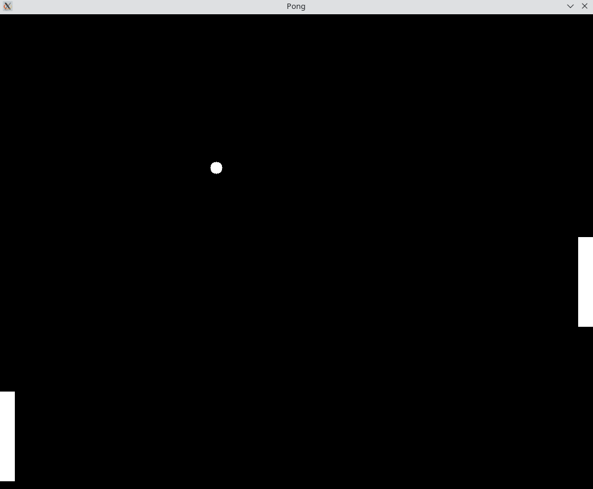

# Snake Game

A classic Pong game implementation using SDL3 (Simple DirectMedia Layer 3) in C.

## Description

This is a simple Pong game made in C using SDL3 library. This game has been made only for learning purpose.

## Prerequisites

- SDL3 library installed on your system
- C compiler (GCC, Clang, etc.)
- Make (optional, for build automation)

## Installation

### Installing SDL3

#### Linux (Ubuntu/Debian):
```bash
# SDL3 may need to be built from source
# Check SDL3 documentation for latest installation instructions
```

#### macOS:
```bash
brew install sdl3
```

#### Windows:
Download SDL3 development libraries from the official SDL website.

## Building

```bash
gcc pong.c -o pong $(sdl3-config --cflags --libs) -lm
```

Or with pkg-config:
```bash
gcc pong.c -o pong $(pkg-config --cflags --libs sdl3) -lm
```

## Controls

- **Arrow Keys**: Control Peddle Movement
  - `↑` (Up Arrow): Move up
  - `↓` (Down Arrow): Move down

> **Note**: The movement of peddle alternates between left and right peddles depending upon the hit flag associated with each peddle. If the hit flag is set to false, the associated peddle with have the movement rights. 

## Screenshots




## License

This project is open source and available for educational purposes.

## Acknowledgments

Built with [SDL3](https://www.libsdl.org/) - Simple DirectMedia Layer 3

---

**Enjoy the game!** 🐍
